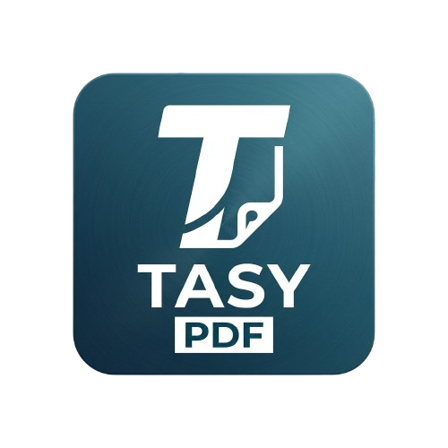

  

# Tasy PDF Auto

O **Tasy PDF Auto** é uma extensão desenvolvida para navegadores Chromium focada em agilizar e otimizar a visualização e a geração de relatórios em PDF dentro do sistema hospitalar Tasy. Ferramenta essencial para equipes de TI e desenvolvedores, ela elimina travamentos, telas piscando e abas excessivas, acelerando testes e a operação diária no sistema.

## Funcionalidades

- **Double Buffering (Troca Suave):** Carrega o PDF em uma camada invisível e só faz a troca quando ele estiver pronto. Isso evita que a tela "pisque" ou fique totalmente cinza durante atualizações sequenciais.
- **Prefetch (Cache Antecipado):** Busca os metadados do relatório proativamente em plano de fundo, muito antes do usuário clicar em salvar. Traz respostas quase instantâneas.
- **Debounce Inteligente:** Corta pela raiz cliques múltiplos acidentais no botão salvar, impedindo que o Tasy dispare requisições em cascata que podem causar lentidão.
- **Bloqueio de Abas Indesejadas:** Intercepta as chamadas nativas manuais para links do tipo `blob:` e redireciona os PDFs para o renderizador aprimorado e limpo da extensão.

## Como instalar

Por não estar atualmente publicada na Chrome Web Store, a instalação leva poucos segundos através do ambiente de desenvolvedor do próprio navegador.

1. **Baixe ou clone o repositório:** Certifique-se de manter todos os arquivos em uma mesma pasta (o arquivo `manifest.json` deve estar na raiz desta pasta).
2. **Abra as configurações do Chrome:** Digite na barra de endereço: `chrome://extensions/`
3. **Modo Desenvolvedor:** No canto superior direito da página, habilite a chave **Modo do desenvolvedor**.
4. **Carregue localmente:** Em seguida, clique no botão **Carregar sem compactação** (Load unpacked) que aparecerá no topo esquerdo e selecione a pasta da extensão.
5. **Pronto!** A extensão será listada e já começará a operar nos quadros do sistema.

## Dica de Uso

Para facilitar a customização no seu dia a dia, sugerimos deixar o acesso rápido visível.

1. Clique no ícone de "Quebra-cabeça" (Extensões) na barra superior do navegador.
2. Encontre a **Tasy PDF Auto** na lista.
3. Clique no botão **Fixar** (o ícone contendo um "alfinete").

## Controle Total (Popup)

Ao clicar sobre o ícone fixado, um painel intuitivo será exibido para você dominar as preferências do sistema. A partir dali, você pode dinamicamente:

* **Ligar/Desligar** a atuação geral da extensão a qualquer momento.
* **Habilitar/Desabilitar** o modo gráfico Double Buffer.
* **Habilitar/Desabilitar** o trabalho invisível de Prefetch/Cache de dados.

## Créditos e Equipe

Este projeto foi construído e aprimorado colaborativamente visando a melhoria do fluxo de trabalho diário de quem precisa gerar e manter relatórios no sistema Tasy. Todo o núcleo lógico e de interceptação gráfica não existiria sem as contribuições diretas de:

* **Matteus** - [@ttmatteus](https://github.com/ttmatteus)
* **Juan** - [@juanlleite](https://github.com/juanlleite)
* **Denes** - [@denesjunior](https://github.com/denesjunior)

